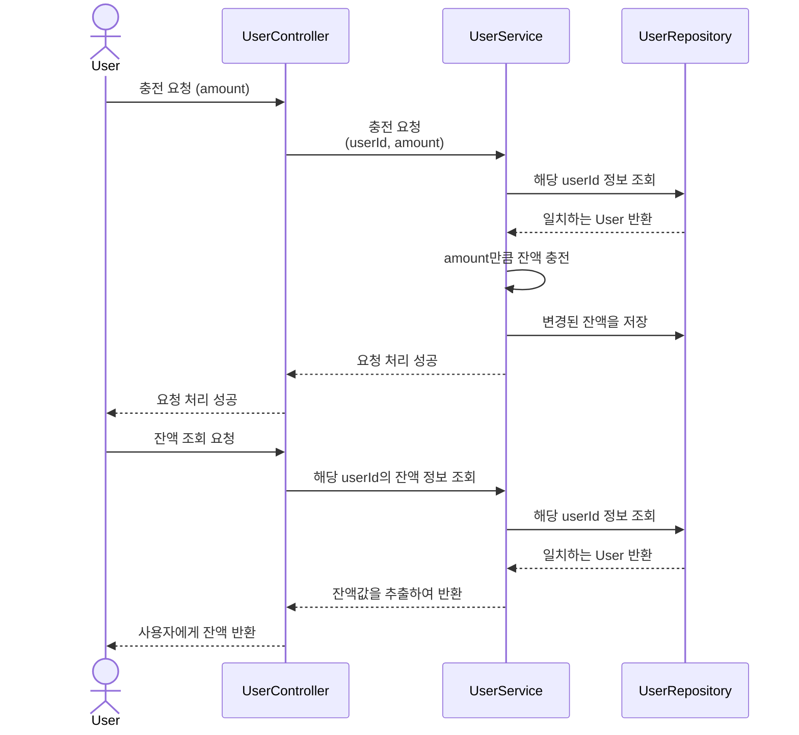

```mermaid
sequenceDiagram
    actor User
    participant UserController
    participant UserService
    participant UserRepository

    %% 잔액 충전 흐름
    User->>UserController: 충전 요청 (amount)
    UserController->>UserService: 충전 요청<br/>(userId, amount)
    UserService->>UserRepository: 해당 userId 정보 조회
    UserRepository-->>UserService: 일치하는 User 반환
    UserService->>UserService: amount만큼 잔액 충전
    UserService->>UserRepository: 변경된 잔액을 저장
    UserService-->>UserController: 요청 처리 성공
    UserController-->>User: 요청 처리 성공

    %% 잔액 조회 흐름
    User->>UserController: 잔액 조회 요청
    UserController->>UserService: 해당 userId의 잔액 정보 조회
    UserService->>UserRepository: 해당 userId 정보 조회
    UserRepository-->>UserService: 일치하는 User 반환
    UserService-->>UserController: 잔액값을 추출하여 반환
    UserController-->>User: 사용자에게 잔액 반환

```