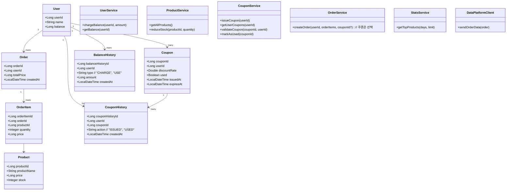

```mermaid
classDiagram

%% -------------------------------
%% 엔티티 클래스 (도메인 모델)
%% -------------------------------

    class User {
        +Long userId
        +String name
        +Long balance
    }

    class Product {
        +Long productId
        +String productName
        +Long price
        +Integer stock
    }

    class Coupon {
        +Long couponId
        +Long userId
        +Double discountRate
        +Boolean used
        +LocalDateTime issuedAt
        +LocalDateTime expiresAt
    }

    class Order {
        +Long orderId
        +Long userId
        +Long totalPrice
        +LocalDateTime createdAt
    }

    class OrderItem {
        +Long orderItemId
        +Long orderId
        +Long productId
        +Integer quantity
        +Long price
    }

    class BalanceHistory {
        +Long balanceHistoryId
        +Long userId
        +String type  // "CHARGE", "USE"
        +Long amount
        +LocalDateTime createdAt
    }

    class CouponHistory {
        +Long couponHistoryId
        +Long userId
        +Long couponId
        +String action  // "ISSUED", "USED"
        +LocalDateTime createdAt
    }

%% -------------------------------
%% 서비스 클래스
%% -------------------------------

    class UserService {
        +chargeBalance(userId, amount)
        +getBalance(userId)
    }

    class ProductService {
        +getAllProducts()
        +reduceStock(productId, quantity)
    }

    class CouponService {
        +issueCoupon(userId)
        +getUserCoupons(userId)
        +validateCoupon(couponId, userId)
        +markAsUsed(couponId)
    }

    class OrderService {
        +createOrder(userId, orderItems, couponId?) // 쿠폰은 선택
    }

    class StatsService {
        +getTopProducts(days, limit)
    }

    class DataPlatformClient {
        +sendOrderData(order)
    }

%% -------------------------------
%% 클래스 간 관계
%% -------------------------------

    User "1" --> "many" Coupon
    User "1" --> "many" Order
    User "1" --> "many" BalanceHistory
    User "1" --> "many" CouponHistory

    Order "1" --> "many" OrderItem
    OrderItem --> Product

    Coupon "1" --> "many" CouponHistory


```