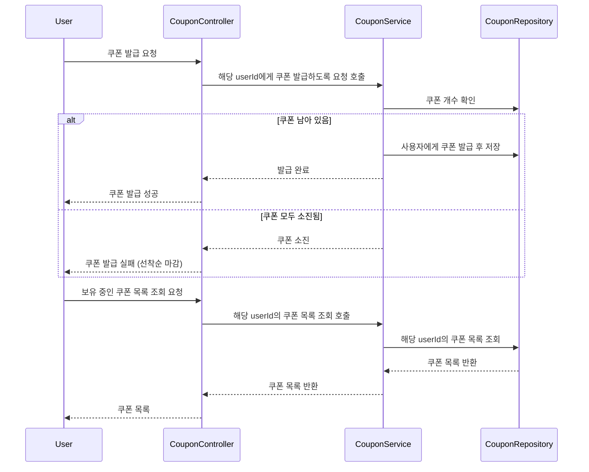

```mermaid
sequenceDiagram
    participant User
    participant CouponController
    participant CouponService
    participant CouponRepository

    %% 쿠폰 발급 흐름
    User->>CouponController: 쿠폰 발급 요청
    CouponController->>CouponService: 해당 userId에게 쿠폰 발급하도록 요청 호출
    CouponService->>CouponRepository: 쿠폰 개수 확인

    alt 쿠폰 남아 있음
        CouponService->>CouponRepository: 사용자에게 쿠폰 발급 후 저장
        CouponService-->>CouponController: 발급 완료
        CouponController-->>User: 쿠폰 발급 성공
    else 쿠폰 모두 소진됨
        CouponService-->>CouponController: 쿠폰 소진
        CouponController-->>User: 쿠폰 발급 실패 (선착순 마감)
    end

    %% 보유 쿠폰 목록 조회 흐름
    User->>CouponController: 보유 중인 쿠폰 목록 조회 요청
    CouponController->>CouponService: 해당 userId의 쿠폰 목록 조회 호출
    CouponService->>CouponRepository: 해당 userId의 쿠폰 목록 조회
    CouponRepository-->>CouponService: 쿠폰 목록 반환
    CouponService-->>CouponController: 쿠폰 목록 반환
    CouponController-->>User: 쿠폰 목록

```