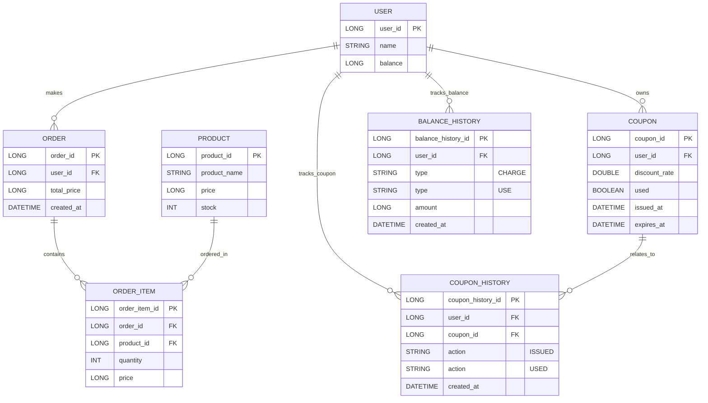

```mermaid
erDiagram

    USER {
        LONG user_id PK
        STRING name
        LONG balance
    }

    PRODUCT {
        LONG product_id PK
        STRING product_name
        LONG price
        INT stock
    }

    COUPON {
        LONG coupon_id PK
        LONG user_id FK
        DOUBLE discount_rate
        BOOLEAN used
        DATETIME issued_at
        DATETIME expires_at
    }

    "ORDER" {
        LONG order_id PK
        LONG user_id FK
        LONG total_price
        DATETIME created_at
    }

    ORDER_ITEM {
        LONG order_item_id PK
        LONG order_id FK
        LONG product_id FK
        INT quantity
        LONG price
    }

    BALANCE_HISTORY {
        LONG balance_history_id PK
        LONG user_id FK
        STRING type "CHARGE"
        STRING type "USE"
        LONG amount
        DATETIME created_at
    }

    COUPON_HISTORY {
        LONG coupon_history_id PK
        LONG user_id FK
        LONG coupon_id FK
        STRING action "ISSUED"
        STRING action "USED"
        DATETIME created_at
    }

    %% 관계 정의
    USER ||--o{ "ORDER" : makes
    USER ||--o{ COUPON : owns
    "ORDER" ||--o{ ORDER_ITEM : contains
    PRODUCT ||--o{ ORDER_ITEM : ordered_in

    USER ||--o{ BALANCE_HISTORY : tracks_balance
    USER ||--o{ COUPON_HISTORY : tracks_coupon
    COUPON ||--o{ COUPON_HISTORY : relates_to

```