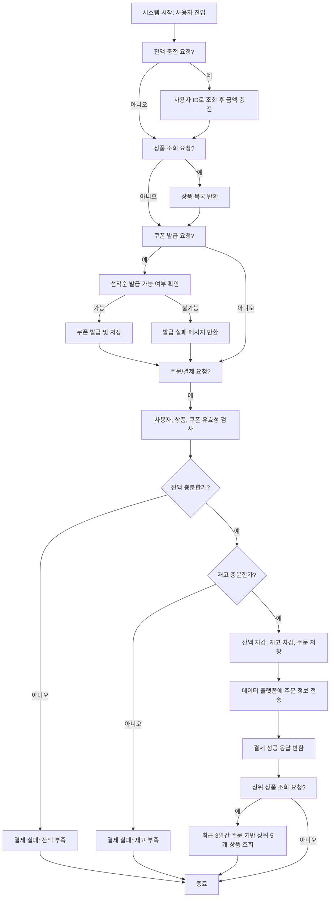

```mermaid
flowchart TD

    A[시스템 시작: 사용자 진입] --> B[잔액 충전 요청?]
    
    B -->|예| B1[사용자 ID로 조회 후 금액 충전]
    B -->|아니오| C[상품 조회 요청?]

    B1 --> C
    C -->|예| C1[상품 목록 반환]
    C -->|아니오| D[쿠폰 발급 요청?]

    C1 --> D
    D -->|예| D1[선착순 발급 가능 여부 확인]
    D1 -->|가능| D2[쿠폰 발급 및 저장]
    D1 -->|불가능| D3[발급 실패 메시지 반환]
    D2 --> E
    D3 --> E

    D -->|아니오| E[주문/결제 요청?]

    E -->|예| E1[사용자, 상품, 쿠폰 유효성 검사]
    E1 --> E2{잔액 충분한가?}
    E2 -->|아니오| E3[결제 실패: 잔액 부족]
    E2 -->|예| E4{재고 충분한가?}
    E4 -->|아니오| E5[결제 실패: 재고 부족]
    E4 -->|예| E6[잔액 차감, 재고 차감, 주문 저장]

    E6 --> E7[데이터 플랫폼에 주문 정보 전송]
    E7 --> E8[결제 성공 응답 반환]

    E3 --> Z[종료]
    E5 --> Z
    E8 --> F[상위 상품 조회 요청?]

    F -->|예| F1[최근 3일간 주문 기반 상위 5개 상품 조회]
    F1 --> Z
    F -->|아니오| Z[종료]

```