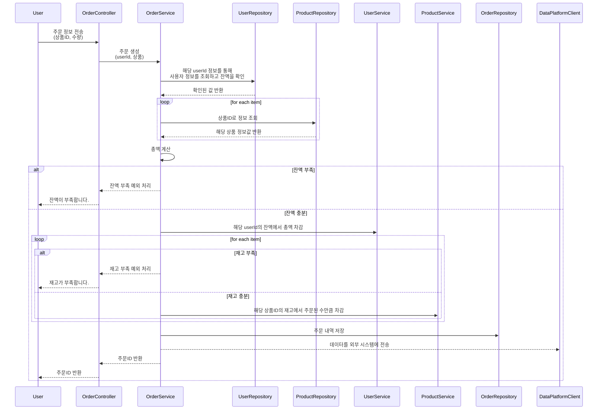

```mermaid
sequenceDiagram
    participant User
    participant OrderController
    participant OrderService
    participant UserRepository
    participant ProductRepository
    participant UserService
    participant ProductService
    participant OrderRepository
    participant DataPlatformClient

    %% 사용자 요청
    User->>OrderController: 주문 정보 전송<br/>(상품ID, 수량)
    OrderController->>OrderService: 주문 생성<br/>(userId, 상품)

    %% 사용자 잔액 확인
    OrderService->>UserRepository: 해당 userId 정보를 통해<br/>사용자 정보를 조회하고 잔액을 확인
    UserRepository-->>OrderService: 확인된 값 반환

    %% 상품 정보 조회
    loop for each item
        OrderService->>ProductRepository: 상품ID로 정보 조회
        ProductRepository-->>OrderService: 해당 상품 정보값 반환
    end

    OrderService->>OrderService: 총액 계산

    %% 잔액 부족 예외 처리
    alt 잔액 부족
        OrderService-->>OrderController: 잔액 부족 예외 처리
        OrderController-->>User: 잔액이 부족합니다.
    else 잔액 충분
        OrderService->>UserService: 해당 userId의 잔액에서 총액 차감

    %% 재고 부족 예외 처리
    loop for each item
        alt 재고 부족
            OrderService-->>OrderController: 재고 부족 예외 처리
            OrderController-->>User: 재고가 부족합니다.
        else 재고 충분
            OrderService->>ProductService: 해당 상품ID의 재고에서 주문된 수만큼 차감
        end
    end

    %% 주문 저장
    OrderService->>OrderRepository: 주문 내역 저장

    %% 외부 데이터 플랫폼 전송 (Mock)
    OrderService-->>DataPlatformClient: 데이터를 외부 시스템에 전송

    %% 응답 반환
    OrderService-->>OrderController: 주문ID 반환
    OrderController-->>User: 주문ID 반환
    end
```