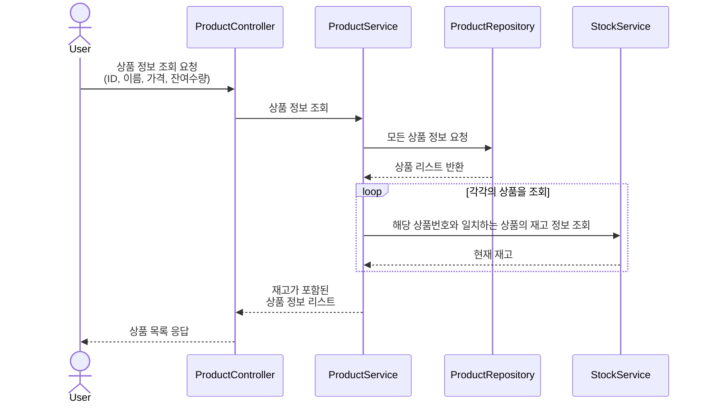

```mermaid
sequenceDiagram
    actor User
    participant ProductController
    participant ProductService
    participant ProductRepository
    participant StockService

    User->>ProductController: 상품 정보 조회 요청<br/>(ID, 이름, 가격, 잔여수량)
    ProductController->>ProductService: 상품 정보 조회
    ProductService->>ProductRepository: 모든 상품 정보 요청
    ProductRepository-->>ProductService: 상품 리스트 반환

    loop 각각의 상품을 조회
        ProductService->>StockService: 해당 상품번호와 일치하는 상품의 재고 정보 조회
        StockService-->>ProductService: 현재 재고
    end

    ProductService-->>ProductController: 재고가 포함된<br/>상품 정보 리스트
    ProductController-->>User: 상품 목록 응답
```