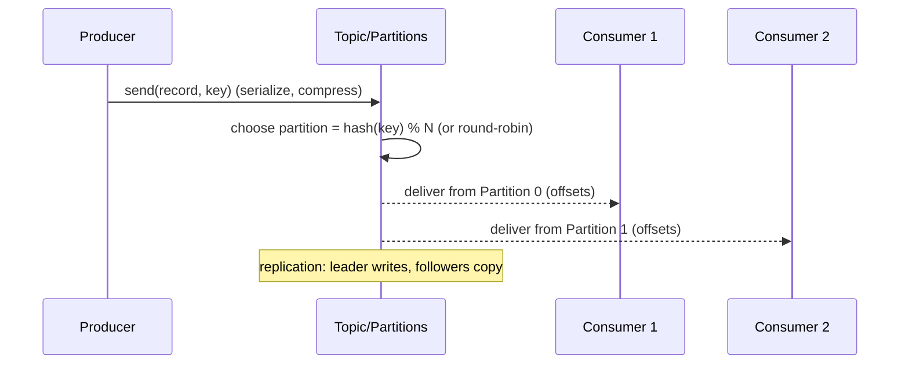

[아파치 카프카 강의](https://youtu.be/waw0XXNX-uQ?si=Ls_pqw2PvpfGmck_)   
해당 강의를 기반으로 작성하였습니다   

# 카프카 기초 개념

## 1. Apache Kafka란?

### 1.1 카프카가 나오기 전
- 소스 애플리케이션과 타겟 애플리케이션의 일대일 연결이 매우 복잡해짐
- 데이터 전송 시 프로토콜 파편화 심각

### 1.2 카프카를 통해 해결
- 소스 애플리케이션과 타겟 애플리케이션의 coupling을 약하게 해줌
- 소스 애플리케이션은 카프카의 데이터를 전송함
- 타겟 애플리케이션은 카프카에서 데이터를 가져옴

### 1.3 카프카의 특징
- 소스 애플리케이션에서 보내는 데이터 포맷 타입에 제한이 거의 없음
- 토픽(큐) 구조로 생산자가 큐에 데이터를 넣고, 컨슈머가 큐에서 데이터를 가져감
- 고가용성으로 서버 장애 상황에서도 데이터 손실 없이 복구 가능
- 낮은 지연과 높은 처리량으로 대용량 데이터 처리 가능

## 2. Topic

### 2.1 Kafka Topic
- 다양한 포맷의 데이터가 들어가는 공간
- 생산자가 큐에 데이터를 넣고 컨슈머가 큐에서 데이터를 가져가는 구조
- 목적에 따라 이름을 지정하여 추후 유지보수 시 편리하게 관리할 수 있음

### 2.2 파티션 구조
- 하나의 토픽은 여러 개의 파티션으로 구성될 수 있음
- 하나의 파티션이 있고, 생산자와 소비자가 하나씩 붙은 경우가 있을 때
- 생산자가 토픽에 발행한 데이터는 큐에 쌓이고, 컨슈머는 오래된 순으로 데이터를 가져감
- 컨슈머가 데이터를 가져가도 데이터가 큐에서 삭제되지 않음
- 컨슈머가 새로 붙으면 기존 큐에 있던 데이터를 가져감
- 컨슈머 그룹이 달라야 하며 auto.offset.reset=earlier 옵션이 존재해야 함
- 동일한 데이터를 다른 컨슈머가 재사용할 수 있음 -> 카프카를 사용하는 중요한 이유

### 2.3 파티셔닝 방식
- 파티션이 두 개 이상인 경우
- 생산자에서 데이터 발행 시 키가 null이면 기본 파티셔너를 사용하여 라운드 로빈으로 할당함
- 만약 키가 있고 기본 파티셔너를 사용한다면 키의 해시를 구해서 특정 파티션에 할당함
- 파티션은 늘릴 수는 있지만 줄일 수는 없으며, 파티션을 늘릴 때는 주의해야 함
- 파티션을 늘리는 이유: 파티션을 늘리면 컨슈머 개수를 늘려서 데이터 처리를 분산시킬 수 있음   
[왜 파티션을 줄일 수 없는지...??](https://junuuu.tistory.com/801)
- -> 여러 복합적인 이유가 있을 수 있으나 다수 브로커에 분배되어 있는 세그먼트를 
다시 재배열하는 것에 상당한 리소스가 들어가기 때문
- 파티션의 레코드 삭제 타이밍: 레코드가 보존되는 시간과 크기 지정 가능

## 3. Producer

### 3.1 주요 역할
- 토픽에 해당하는 메시지를 생성
- 특정 토픽으로 데이터를 publish
- 처리 실패 시 재시도

### 3.2 구현 구성요소
- Properties configs: 프로듀서 설정 (부트스트랩 서버, key-value 직렬화 설정)
- KafkaProducer: 카프카 프로듀서 인스턴스. 레코드(데이터)를 전송함
- ProducerRecord: 전송할 데이터 객체

### 3.3 파티션 할당 방식
- key가 null이고 파티션이 하나인 경우 -> 큐에 차례대로 쌓임
- key가 null이고 파티션이 두 개인 경우 -> 라운드 로빈 방식으로 쌓임
- key가 존재하고 파티션이 두 개인 경우 -> 하나의 파티션에 동일한 레코드가 쌓임

## 4. 고가용성

### 4.1 브로커 구성
- 카프카가 설치된 서버 단위
- 세 개 이상의 브로커로 구성하는 것을 권장
- 파티션이 한 개이고 replica가 1인 토픽이 있다면 브로커 3대 중 1대에 토픽 데이터가 저장됨
- 레플리카 수는 브로커 개수보다 적어야 함

### 4.2 복제(Replication) 메커니즘
- 원본 파티션을 leader 파티션, replica의 파티션을 follower 파티션이라고 함
- leader + follower = ISR(In Sync Replica)
- leader 파티션이 있던 브로커에 장애가 발생해도, follower 파티션이 데이터를 유지하므로 데이터 보존 가능
- leader가 죽은 경우 다른 follower 파티션이 leader 역할을 승계함

### 4.3 ACK 옵션
- **ack=0**: 프로듀서가 브로커에 데이터를 전송하고 응답값을 받지 않음.
    leader에 데이터가 잘 전달됐는지, 복제가 됐는지 확인 불가능함.
    속도는 빠르지만 데이터 유실 가능성 존재
- **ack=1**: leader에 데이터가 잘 전달됐는지 응답하지만, 복제 확인 불가능.
  만약 leader가 데이터를 받은 직후 장애가 난다면 복제가 잘 됐는지 알 수 없으므로 데이터 유실 가능성 존재
- **ack=all**: leader에 데이터 전달과 복제 모두 확인. 데이터 유실은 없지만 복제될 때까지 기다려야 하므로 시간이 오래 걸림

### 4.4 Replication count
- replica 수가 많아지면 고가용성이 높아짐
- 그만큼 중복되는 데이터가 많아지고, 브로커 리소스 사용량이 많아짐
- -> 카프카에 들어오는 데이터양과 저장 시간을 고려해서 replica 수를 정해야 함

## 5. Consumer

### 5.1 카프카만의 특징
- 다른 메시징 서버와 달리, 카프카는 컨슈머가 데이터를 가져와도 토픽에 데이터가 남아있음
- 이러한 특징은 카프카를 데이터 파이프라인으로 운영하는데 매우 중요함

### 5.2 주요 개념
- **Polling**: 컨슈머가 토픽 내부 파티션에 저장된 데이터를 가져오는 방식
- **Offset**: 파티션 내에서 데이터가 가지는 고유한 번호로, 컨슈머가 데이터를 어느 지점까지 읽었는지 확인하는 용도
- **__consumer_offsets 토픽**: 컨슈머의 오프셋 커밋 정보가 저장되는 토픽

### 5.3 Consumer Group
- 각기 다른 컨슈머 그룹에 속하는 컨슈머들은 다른 컨슈머 그룹에 영향을 미치지 않음
- 컨슈머 그룹은 다른 컨슈머 그룹과 함께 토픽을 동시에 읽을 수 있음

### 5.4 파티션과 컨슈머의 관계
- 파티션이 두 개 있는 상황이라고 가정할 때
- 컨슈머 1개: 두 개의 파티션에서 가져감
- 컨슈머 2개: 각 컨슈머가 각각의 파티션에서 가져감
- 컨슈머 3개: 세 번째 컨슈머는 할당받을 파티션이 없으므로 동작하지 않음

## 6. Consumer Lag

### 6.1 개념
- 프로듀서가 데이터를 넣는 속도가 컨슈머가 가져가는 속도보다 빨라질 때 발생하는 두 오프셋 간의 차이

### 6.2 모니터링의 중요성
- lag의 숫자를 통해 현재 해당 토픽에 대해 파이프라인으로 연계된 프로듀서와 컨슈머의 상태를 알 수 있음
- 주로 컨슈머의 상태를 파악하는데 사용됨

## 7. Partitioner

### 7.1 역할
- 프로듀서가 데이터를 보내면 무조건 파티셔너를 거쳐 브로커로 데이터가 전송됨
- 파티셔너는 데이터를 토픽의 어떤 파티션으로 보낼지 결정함

### 7.2 디폴트 파티셔너
- 디폴트 파티셔너는 UniformStickyPartitioner
- 메시지 키가 있을 때는 해시값으로 변환하여 파티션에 할당

### 7.3 데이터 순서 보장
- 동일한 키를 가진 레코드는 동일한 파티션으로 들어가기 때문에
- 순서를 지켜 데이터 처리 가능

### 7.4 커스텀 파티셔너
- Partitioner 인터페이스를 구현하여 커스텀 파티셔너를 만들 경우
- 메시지 키나 값, 토픽 이름으로 어느 파티션에 데이터를 넣을 것인지 지정 가능

## 8. 구성 요소 간 데이터 흐름

- Producer: 레코드(key/value)를 직렬화해 브로커로 전송 → Partitioner가 파티션을 결정
- Topic/Partition: Append-only 로그로 저장, 각 레코드는 offset을 가짐(보존 기간/크기 정책에 따라 삭제)
- Replication: Leader에 쓰고 Follower로 복제 → acks에 따라 내구성 보장 수준 선택
- Consumer Group: 파티션을 컨슈머들에 분배(동시 처리), 읽은 위치는 오프셋 커밋으로 관리
- 순서 보장: 같은 키는 같은 파티션으로 → 파티션 내 순서 보장(글로벌 순서 X)

## 9. 카프카의 장단점

### 9.1 장점
- 파티션, 컨슈머 그룹으로 병렬 처리 쉬움
- 고가용성
- 로그 보존기간 동안 오프셋을 되감아 재처리 가능
- 생산자, 소비자 독립 배포 및 확장 → 아키텍처 유연성 증가
- Avro, Protobuf, JSON 등 다양한 포맷 지원

### 9.2 단점
- 순서는 파티션 내만 보장함
- 파티션 축소 불가
- 강한 내구성 설정 시 레이턴시 증가 가능
- 저장, 네트워크 비용 -> 장기 보존, 고복제는 자원 비용이 증가할 수 있음
- 컨슈머 처리 지연 시 Lag 증가, 리커버리 전략 필요