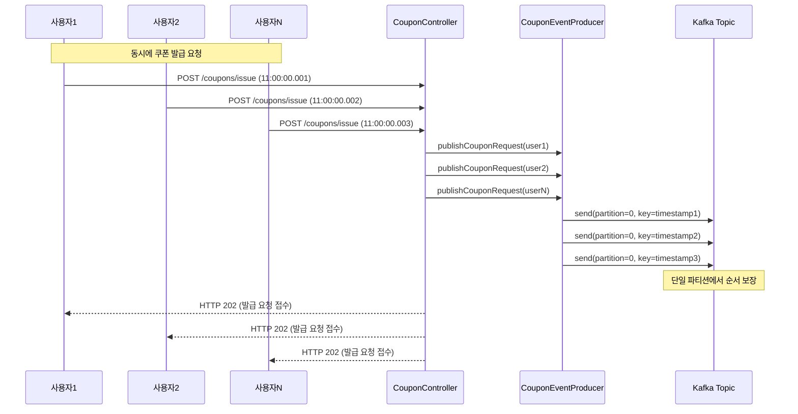
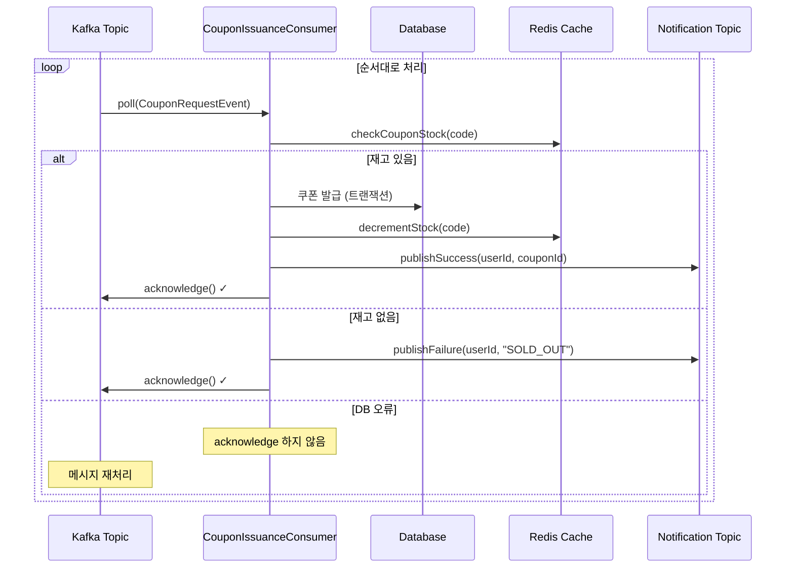

# 카프카의 특징을 활용한 선착순 쿠폰 발급 설계

## 1. 현재 구조 vs 개선 구조

### 1.1 기존 구조 (Redis 기반)
```
쿠폰 발급 요청 → CouponController → CouponService
                                        ↓
                    Redis 대기열 + 스케줄러 배치 처리
                                        ↓
                    DB 저장 + 상태 업데이트
```

- 스케줄러 기반 배치 처리로 실시간성 부족
- Redis 단일 장애점으로 인한 가용성 문제
- 복잡한 상태 관리 로직으로 인한 유지보수 어려움

### 2.2 개선 구조 (Kafka 기반)
```
쿠폰 발급 요청 → CouponController → CouponEventProducer → Kafka Topic
                                                             ↓
                                    CouponIssuanceConsumer → DB 저장
```

- 이벤트 스트리밍으로 실시간 처리
- 파티션 기반 순서 보장 및 병렬 처리
- Consumer Group을 통한 장애 격리 및 확장성

---

## 2. Kafka 구성 설계

### 2.1 Topic 설계

#### **coupon.issuance.requested Topic**
```
Topic Name: coupon.issuance.requested
Partitions: 1개 (순서 보장)
Replication Factor: 3
Retention: 24시간
Cleanup Policy: delete
```

**단일 파티션 선택 이유:**
- 선착순 처리를 위해 전역적인 순서 보장 필요
- 쿠폰 코드별로 요청 순서가 중요

#### **coupon.issuance.completed Topic**
```
Topic Name: coupon.issuance.completed
Partitions: 3개
Replication Factor: 3
Retention: 7일
Cleanup Policy: delete
Key: userId
```

**다중 파티션 활용:**
- 발급 완료 후 알림은 병렬 처리 가능
- 사용자별 파티셔닝으로 부하 분산

### 2.2 Producer 설정
```yaml
Producer Configuration:
  acks: all                    # 모든 replica 확인
  retries: 3                   # 전송 실패 시 재시도
  enable.idempotence: true     # 중복 발급 방지
  max.in.flight.requests: 1    # 순서 보장 (단일 파티션)
  compression.type: lz4        # 빠른 압축
  batch.size: 1KB              # 작은 배치 (실시간성 우선)
  linger.ms: 0                 # 즉시 전송
```

### 2.3 Consumer 설계

#### **쿠폰 발급 Consumer Group**
```yaml
Group ID: coupon-issuance-group
Consumer Count: 1개 (단일 파티션)
Auto Offset Reset: earliest
Enable Auto Commit: false      # 수동 커밋
Session Timeout: 10s           # 빠른 장애 감지
Max Poll Records: 1            # 하나씩 처리 (순서 보장)
```

---

## 3. 시퀀스 다이어그램

### 3.1 선착순 쿠폰 발급 요청



### 3.2 순차적 쿠폰 발급 처리



---

## 4. 구현 예제

### 4.1 CouponEventProducer 구조
```java
@Service
public class CouponEventProducer {
    
    // 선착순 보장을 위한 순서 있는 발행
    public void publishCouponRequest(CouponRequestEvent event) {
        kafkaTemplate.send(
            "coupon.issuance.requested",
            0,  // 고정 파티션 (순서 보장)
            System.nanoTime(), // 정확한 타임스탬프 키
            event
        );
    }
}
```

### 4.2 CouponIssuanceConsumer 구조
```java
@Component
public class CouponIssuanceConsumer {
    
    @KafkaListener(
        topics = "coupon.issuance.requested",
        groupId = "coupon-issuance-group"
    )
    public void processCouponRequest(CouponRequestEvent event, Acknowledgment ack) {
        try {
            // 순차적 쿠폰 발급 처리
            issueCouponSequentially(event);
            ack.acknowledge(); // 처리 완료 후 커밋
        } catch (Exception e) {
            // 실패시 acknowledge 하지 않음 (재처리)
            log.error("쿠폰 발급 실패, 재처리 예정", e);
        }
    }
}
```
